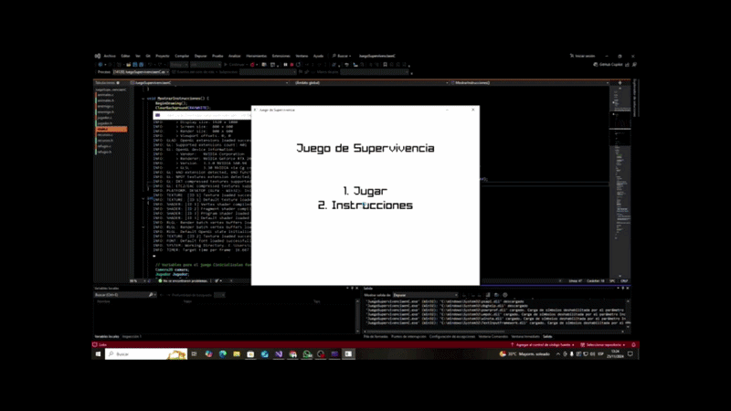

# Juego de Supervivencia en C

Juego 2D desarrollado en lenguaje C utilizando la librería gráfica Raylib. El proyecto está enfocado en la implementación de lógica de juego, organización modular del código y manejo de entidades dentro de un entorno interactivo.

---

## 🧩 Descripción

Este proyecto simula un entorno de supervivencia donde el jugador puede moverse por un mapa, interactuar con distintos elementos, recolectar recursos y enfrentarse a enemigos.

Fue desarrollado como práctica para afianzar conceptos de programación en C y estructura de proyectos de mayor escala.

---

## 🧠 Características

- Sistema de jugador con movimiento e interacción
- Enemigos con comportamiento básico
- Recolección de recursos
- Renderizado de mapa en tiempo real
- Uso de sprites e imágenes
- Organización modular del código en múltiples archivos

---

## 🛠 Tecnologías utilizadas

- Lenguaje: C
- Librería gráfica: Raylib
- Entorno de desarrollo: Visual Studio

---

## 📁 Estructura del proyecto

- `main.c`: punto de entrada del programa
- `jugador.*`: lógica del jugador
- `enemigo.*`: comportamiento de enemigos
- `mapa.*`: gestión del mapa
- `recursos.*`: manejo de recursos
- `utilidades.*`: funciones auxiliares
- Archivos `.png`: recursos gráficos del juego

---

## ▶️ Cómo ejecutar

1. Descargar e instalar Raylib desde:
   https://www.raylib.com/

2. Abrir el proyecto en Visual Studio  
   o compilar manualmente con GCC (si se tiene configurado)

3. Ejecutar el programa generado

> Nota: Es necesario tener Raylib correctamente configurado en el entorno de desarrollo.

---

## 🎮 Demo

---

## 📌 Aprendizajes

Durante el desarrollo de este proyecto se trabajó en:

- Organización de código en múltiples módulos en C
- Separación de responsabilidades entre componentes
- Uso de librerías externas (Raylib)
- Manejo de estructuras y lógica de juego
- Desarrollo de aplicaciones interactivas

---

## 🎯 Objetivo

El objetivo de este proyecto es servir como práctica y base para el desarrollo de habilidades en programación en C, especialmente en proyectos más complejos y estructurados.

---

## 👨‍💻 Autor

Lucas Aguirre Montenegro
